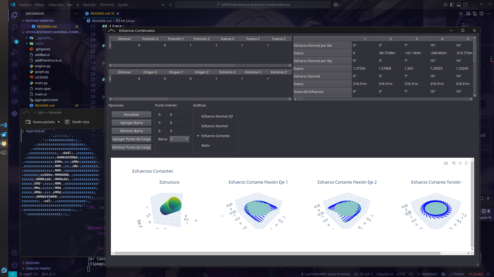

# UPIITA Resistance Material - Combined Stress

## 🎥 Demo:

[](https://youtu.be/y4GYawCsVuc)

## 📸 Screenshots





## 🚀 Installation and Setup

### Windows:

```bash
.\.venv\Scripts\activate
pip install -r requirements.txt
python .\main.py

pyinstaller --onefile -w main.py
```

### Linux:

```bash
sudo dnf install python3-virtualenv python3-devel gcc gcc-c++ make
python -m venv .venv
source .venv/bin/activate
pip install -r requirements.txt
python .\main.py
```

## 📦 Dependency Management

### Generate requirements:

```bash
pip freeze > requirements.txt
```

### Install requirements:

```bash
pip install -r requirements.txt
```
